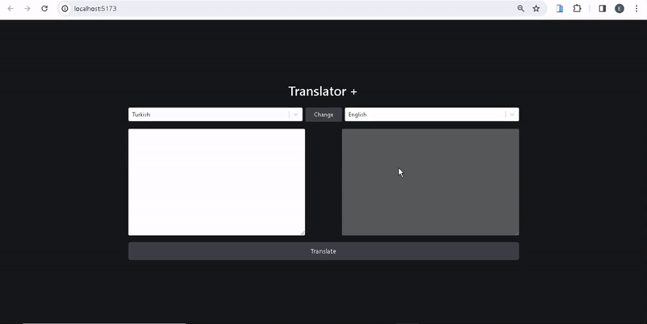

<h1> Translate_app</h1>

I've independently designed and coded a responsive Translate_app, and it's ready to explore!

🔸 Project Name: [Translate app]

🔸 Technologies Used: React and Redux Toolkit, Tailwind CSS, Axios

🔸 Project Description: This website, which I designed and coded from scratch, works flawlessly on various devices, from mobile phones to desktop computers. This app seamlessly translates text between 111 languages ​​using data from API's.

<h2>Screen_Shoot</h2>

